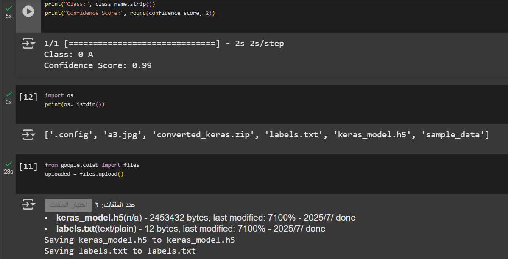
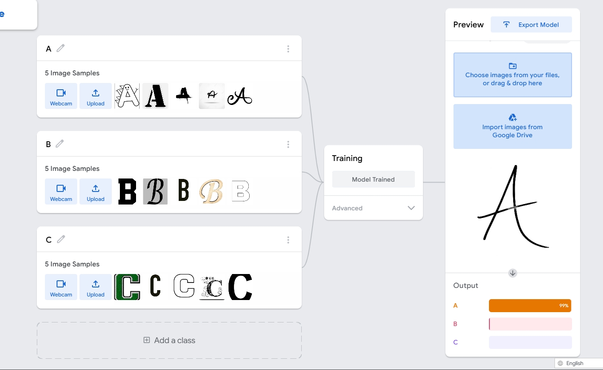

# Letter-Classifier-AI

A simple image classification project that uses a Teachable Machine-trained model to recognize handwritten or printed letters from images.  
Built using **Keras** and **TensorFlow** in **Google Colab**, this project loads a pre-trained `.h5` model and predicts the class of an uploaded image (e.g., A, B, C).

---

## 📌 Features
- ✅ Trained using [Teachable Machine](https://teachablemachine.withgoogle.com/)
- ✅ Accepts images in `.jpg` format
- ✅ Uses a `.h5` model and `labels.txt` for predictions
- ✅ Runs in Google Colab (no local setup needed)
- ✅ Prints the predicted class and confidence score

---

## 🧠 Technologies Used
- Python
- TensorFlow & Keras
- PIL (Python Imaging Library)
- Google Colab

---

## 📁 Files Included

| File Name               | Description                                        |
|-------------------------|----------------------------------------------------|
| `keras_model.h5`        | The exported Keras model from Teachable Machine   |
| `labels.txt`            | List of class names used during training          |
| `predict_image.py` | The script to load and run predictions       |
| `output.png`        | Google Colab output showing prediction result     |
| `output2.png`           | Screenshot of the model setup in Teachable Machine |

---

## 🚀 How to Use

1. Upload the following files in your Google Colab environment:
   - `keras_model.h5`
   - `labels.txt`
   - An image (e.g., `a3.jpg`)

2. Run the provided script to make predictions.

3. Output will show:
   - Predicted class (e.g., `A`)
   - Confidence score (e.g., `0.99`)

---

## 🖼️ Sample Output

### 🔹 Training Preview from Teachable Machine

